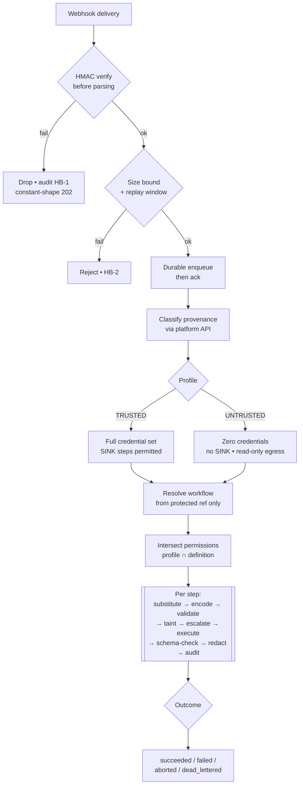
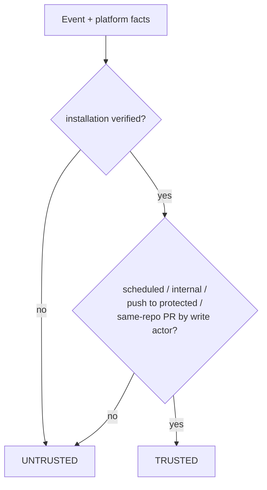

# Event lifecycle

The path an event takes from webhook to audited outcome. The Runner is the single
enforcement chokepoint (spec §8.1).

```mermaid
flowchart TD
    A[Webhook delivery] --> B{HMAC verify\nbefore parsing}
    B -- fail --> X1[Drop • audit HB-1\nconstant-shape 202]
    B -- ok --> C{Size bound\n+ replay window}
    C -- fail --> X2[Reject • HB-2]
    C -- ok --> D[Durable enqueue\nthen ack]
    D --> E[Classify provenance\nvia platform API]
    E --> F{Profile}
    F -- TRUSTED --> G[Full credential set\nSINK steps permitted]
    F -- UNTRUSTED --> H[Zero credentials\nno SINK • read-only egress]
    G --> I[Resolve workflow\nfrom protected ref only]
    H --> I
    I --> J[Intersect permissions\nprofile ∩ definition]
    J --> K[[Per step:\nsubstitute → encode → validate\n→ taint → escalate → execute\n→ schema-check → redact → audit]]
    K --> L{Outcome}
    L --> M[succeeded / failed /\naborted / dead_lettered]
```

## Provenance decision (spec §2.1)

```mermaid
flowchart TD
    S[Event + platform facts] --> V{installation verified?}
    V -- no --> U[UNTRUSTED]
    V -- yes --> T1{scheduled / internal /\npush to protected /\nsame-repo PR by write actor?}
    T1 -- yes --> TR[TRUSTED]
    T1 -- no --> U
```
